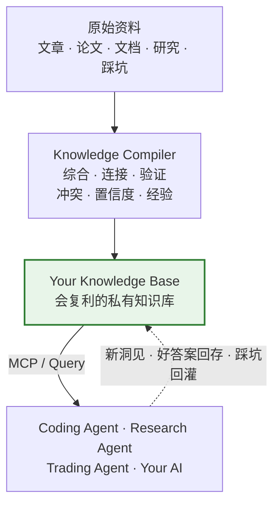
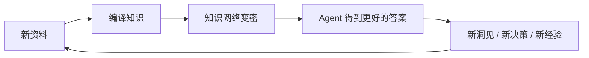
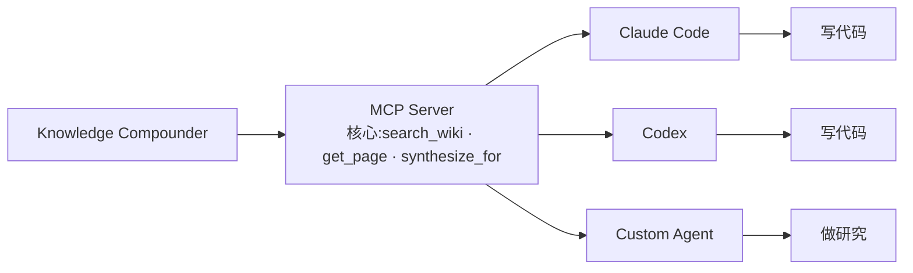
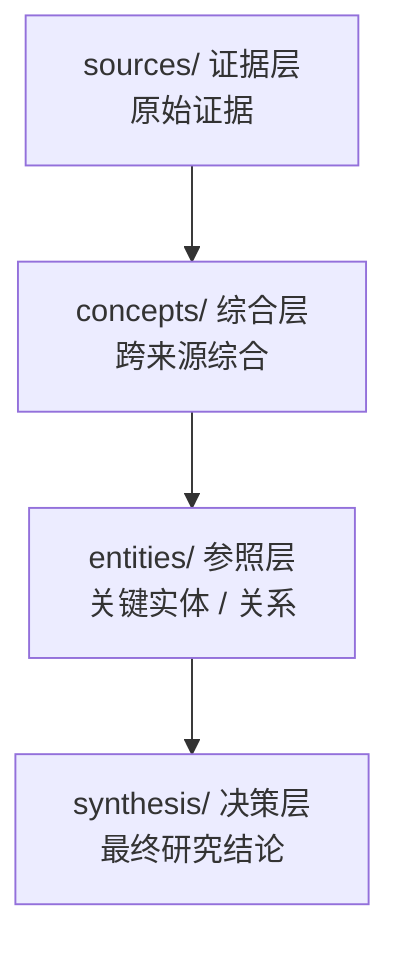
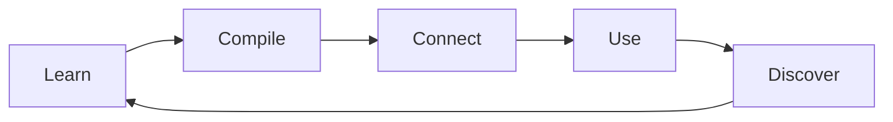

# Knowledge Compounder — 让 AI 不再每次都从零开始

[](LICENSE)
[](https://go.dev/dl/)
[](https://github.com/gcc2ge/knowledge-compounder)

> **你的 AI 为什么每次都像新员工?** 你昨天刚告诉过它的架构决策、验证过的方案、踩过的坑,今天换一个对话,它全忘了——于是你只能重新解释背景、重新找资料、重新分析、重新踩坑。
>
> **Knowledge Compounder(KCP)** 把你读过的东西、踩过的坑、做过的研究,编译成一份 AI 可以长期使用的私有知识库。**喂进去的是文章,长出来的是手册**——你的 AI 干起活来像老员工,你的知识越用越值钱。

> 理想效果不是展示代码,而是让读者一眼看懂「知识编译 → 知识复利」在做什么:
> `raw/article.md` → `kcp compile` → `sources/` `concepts/` 生成 → `kcp query "xxx?"` → 一份已经综合好的答案 → Claude Code / Codex 直接带着结论干活

---

## 你的 AI 总像一个刚入职的新人

昨天你刚告诉它:

- 项目的架构为什么这么设计
- 哪个方案已经验证过了
- 哪个坑之前踩过
- 哪种写法在你的项目里禁止使用
- 你研究了几天之后得出的结论

今天换一个对话,它又忘了。

于是你只能:**重新解释背景 → 重新找资料 → 重新分析 → 重新踩坑。**

与此同时,你自己的知识可能已经堆在 Bookmarks / Notion / Obsidian / PDF / GitHub / Chat History / 本地 Markdown。

**资料越来越多,知识却没有越来越值钱。**

## KCP:让知识开始复利

Knowledge Compounder(KCP)是一套面向 AI Agent 的**知识编译与复利系统**。

它不是简单地把文章存起来,也不是把原文切成 Chunk 再做一次 RAG。它做的是:



**一句话理解:喂进去的是文章,长出来的是手册。**

传统知识库更关注「帮我找到这篇文章」;KCP 更关注「把我过去积累的知识,直接变成下一次可以使用的答案」。

## 最核心的区别:把思考提前到写入时

假设你连续读了 5 篇关于 Go Channel 的文章。

**普通 RAG** 得到的是:Chunk A / Chunk B / Chunk C / Chunk D / Chunk E。

下次 AI 问「Go Channel 如何避免 goroutine 泄漏?」时,模型还需要:

```
检索 → 阅读多个 Chunk → 判断哪些相关 → 综合 → 处理冲突 → 生成答案
```

**KCP** 会在知识进入系统的时候就完成这部分工作:

```
5 篇文章
   │  编译
   ├── 核心结论      ├── 关键连接
   ├── 论证链        ├── 意外发现
   ├── 代码证据      ├── 疑点 / 边界
   ├── 来源          └── 置信度
   │
   ▼
一份知识手册
```

下一次 Agent 不需要重新读 5 篇文章,它直接得到:**结论 + 证据 + 来源 + 边界 + 历史经验。**

## 为什么叫「知识编译」

**传统 RAG**:原始资料 → 切 Chunk → 建立索引 → 用户提问 → 检索 Chunk → LLM 现场综合 → 答案结束。

**KCP**:原始资料 → 编译(理解 / 综合 / 连接 / 冲突 / 置信度)→ 知识资产 → 用户提问 → **直接复用已经编译好的知识**。

核心思想很简单:

> **把最贵的思考,从「每次读取」提前到「知识写入」。**

一篇文章可能只需要认真读一次,但未来你可能会问它一百次。为什么每次查询都重新付一次「理解 + 综合」的成本?

KCP 选择把这部分思考提前完成,并把结果保存下来——代价一次性付,收益摊到每一次查询上。

## 更重要的是:知识不会停在这里

KCP 的目标不是建立一个静态知识库,而是建立一个**知识复利循环**:



所以 KCP 有三个「复利发生点」:

**① 编译时复利** —— 新文章进入系统时,会和已有知识连接。新知识不是孤立增加,而是在已有知识网络上继续生长。

**② 查询时复利** —— 一个值得保存的研究结果,可以直接固化成新的 synthesis。一次研究 → 永久资产。

**③ 失败时复利** —— 踩过的坑、失败的方案、错误的决策可以回灌。同一个坑,只踩一次。

## 从「收藏」到「拥有」

这可能是 KCP 最想解决的问题。

很多人的知识管理实际上是:**看到好文章 → 收藏 → 收藏夹越来越大 → 再也没看过。**

KCP 希望变成:**看到好文章 → 编译 → 连接已有知识 → 形成自己的理解 → 以后 Agent 可以直接使用 → 新的研究继续修改 / 丰富它。**

> **读过不等于拥有。编译过,才真正成为你的知识。**

## 一个真实的知识单元

例如原始资料里只有这样一段 Go(取自 `examples/raw-demo.md`):

```go
select {
case ch <- v:
case <-ctx.Done():
    return // 消费者已退出,别阻塞泄漏
}
```

KCP 编译之后,不只是把代码存起来,而是形成**一个可以直接被 Agent 使用的知识单元**(完整产物见 `examples/compiled/source-demo.md`,合成演示、展示真实编译纪律):

| 编译纪律 | 产物里长什么样 |
|---|---|
| 一句话结论 | Go channel 并发有三个铁律——生产者负责关闭、发送时 select 监听取消、错误走同一个 channel——共同解决发送阻塞导致的 goroutine 泄漏 |
| 论证链(逐字保留) | 上面那段 Go 代码**原样**躺在论证链里,不缩写、不转述 |
| 意外发现 | 泄漏 bug 在测试期几乎测不出来,只在长期运行的压力下浮出——防泄漏必须靠结构纪律,而不是测试 |
| 疑点 / 边界 | 「错误走同一 channel」在并行多路时会成为瓶颈——未验证边界,不影响单对场景的正确性 |
| 来源 | `examples/raw-demo.md` + 论证链逐字证据 |

于是 Agent 得到的不再是「这里有一段关于 Go Channel 的文章」,而是**「这是关于 Go Channel 的一个已经整理好的工程知识单元」**。

## KCP 不是「又一个 RAG」

这是 KCP 最重要的定位区别:

|  | 传统 RAG | Knowledge Compounder |
|---|---|---|
| 核心目标 | 找到相关内容 | 形成可复用知识 |
| 检索对象 | 原文 Chunk | 编译后的知识 |
| 综合发生 | 查询时 | 写入时 |
| 知识之间的连接 | 弱 | 强 |
| 冲突处理 | LLM 现场判断 | 编译时显式记录 |
| 历史答案 | 通常丢失 | 可以固化 |
| 踩坑经验 | 不会自动沉淀 | 可以回灌 |
| 使用越久 | 资料越来越多 | 知识越来越密 |
| 最终效果 | 更大的资料库 | 更好的「长期员工」 |

可以把它理解成:**RAG 解决「找到资料」,KCP 解决「让资料变成资产」。**

技术说明:KCP 的检索层本身使用 **BM25 + Vector 混合检索**——但这里有一个关键区别:**RAG 是检索层,知识编译才是 KCP 的核心价值。**

> 📊 值不值得,用数据说话。`kcp eval` 提供可复现的对照实验(最新跑分:deepseek-v4-flash / 9 seeds)——编译复利 vs 原文 RAG:**可迁移性 +1.2、均分 +0.3**;综合密度与连接价值目前持平,增益集中在「把结论迁移到新问题」上。等测试集更完整、可复现后,这里会放一份独立的 benchmark 章节。详见 `docs/03-与RAG的区别.md`。

## 给 AI 一个「长期员工」:通过 MCP 接入

KCP 可以通过 MCP 接入其他 Agent:



Agent 不需要知道你的整个知识库。对大多数场景,掌握这三个核心工具就够了:

- `search_wiki` —— 混合检索(词法 + 语义),返回标题 + 私有度徽标 + 命中分 + 摘要
- `get_page` —— 深读一个知识页
- `synthesize_for` —— 检索 + LLM 综合成带引用的答案

MCP server 还注册了 `wiki_mentions` / `backlinks` / `get_related` / `list_recent` / `capture_note`(共 8 个工具),需要时按名调用。

然后就可以获得:**过去的架构决策、私有工程规范、历史踩坑、研究结论、交易复盘、项目背景、已验证方案、不应该再尝试的方案。**

也就是说,**KCP 可以成为 Coding Agent / Research Agent / Trading Agent 的长期外脑。**

### 三个特别适合的场景

**01 · Coding Agent** —— 把架构决策、技术方案、代码规范、踩坑记录、Bug 根因、性能优化、项目约定沉淀进去。Agent 不再只是「帮我写代码」,而是「按照这个项目过去的架构决策和踩坑经验来写」。

**02 · Research Agent** —— 文章、论文、RFC、GitHub、实验不断进入知识库,每一次研究都在丰富已有知识。最后得到的不是一堆收藏,而是一套属于自己的研究知识网络。

**03 · Trading / Decision Agent** —— 把交易复盘、失败案例、市场观察、策略假设、实验结果、风险事件全部回灌。下一次做决策时,Agent 可以直接看到过去发生过什么。

## 知识如何组织?——四层,一份员工手册

KCP 不把所有东西都当成 Chunk。目前核心知识分成四层:



| 层 | 装什么 | 在复利里的角色 |
|---|---|---|
| `sources/` 证据层 | 每个原始文件的完整论证:结论、论证链、意外发现、疑点 | 原始证据逐字保真,别页引用时有据可查 |
| `concepts/` 综合层 | **跨源综合**:多个来源讲同一个概念时连接起来,记录支持 / 冲突 / 置信度 / 张力 / 缺口 | **知识复利的核心区域**,越喂越密 |
| `entities/` 参照层 | 人物、项目、工具、组织等重要实体 | 帮 Agent 在知识网络中找到正确的路径 |
| `synthesis/` 决策层 | 值得长期保存的研究结果,固化成综合页 | **一次 Query → 一次好的研究 → 永久知识资产** |

检索时不挑类型:全部页面进同一个混合索引,按相关性排序;每条结果带**私有度徽标**(`[A]` 公开 / `[B]` 精选综合 / `[C]` 私有踩坑),agent 按徽标判断该多信哪句,再用 `get_page` 深读。**类型不是给 agent 选的菜单,是编译时埋好的分工。**

概念页建不建由你裁决;编译错了也有兜底:`kcp lint` + `review_after` 复核,`wiki/` 是纯文本 + git,错了可回滚。

## 技术上,它是一个完整的 Agent Runtime

KCP 不只是几个 Prompt + 一个向量数据库。项目本身包含一个用 Go 实现的 Agent Runtime:

```
cmd/kcp
   ├── Provider            OpenAI Compatible / Anthropic(能力位抽象)
   ├── Agent Runtime       Think → Act → Observe + 停止条件 + 错误自愈
   ├── Tools               Search / Wiki / Mentions / Backlinks / Read·Write / Lint
   ├── Knowledge Compiler  SCHEMA 驱动的编译循环
   ├── Hybrid Index        倒排 + 向量混合检索
   └── MCP Server          纯标准库实现的 stdio server
```

**为什么自己实现 Agent Runtime?** 因为 KCP 的核心方法论应该和具体 Agent 解耦。你可以使用 OpenAI / DeepSeek / Ollama / OpenRouter / Anthropic……而知识编译流程保持不变。

同时整个项目:**纯 Go + 单二进制 + 零第三方 Go 依赖**(`go.mod` 里没有任何外部依赖),Clone 下来 `go build` 就能跑。

工具层纪律:**能确定性解决的绝不交给概率**——「术语被几个源提及」这类建页判据由 `wiki_mentions` 直接计数返回结论,LLM 不做模糊搜索去数文件;语义判断才留给模型。

**两个支柱 + 一条闭环:**

```
支柱 A: compiler(写)   raw → 编译进 wiki(批量、自主 agent,SCHEMA 驱动)
支柱 B: context(读)    wiki → MCP server → coding/trading/自定义 agents 当外脑
闭环:   observe        踩坑/失败/新模式 → raw/observations → 编译回灌 → wiki 更密
```

设计文档:`docs/06-harness设计.md`、`SCHEMA.md`(编译纪律)。

## 5 分钟开始

> 要求:Go 1.24+。纯 Go、零第三方依赖,`go build` 一个二进制搞定。完整逐步教程见 `docs/01-上手.md`。

**1. Clone**

```bash
git clone https://github.com/gcc2ge/knowledge-compounder.git
cd knowledge-compounder
```

**2. Build**

```bash
go build -o kcp ./cmd/kcp
```

**3. 不需要 API Key,先直接玩**

```bash
./kcp status                    # 知识库状态 + 未编译 raw
./kcp lint                      # 健康检查(断链/孤儿/格式)
./kcp search "go channel 泄漏"  # 混合检索,带 [A]/[B]/[C] 私有度徽标
```

clone 之后立刻就能看到真实输出(知识库状态、检索结果、相关性分数、私有度):

```bash
$ KCP_RETRIEVE_K=1 ./kcp search "go channel 泄漏"
检索「go channel 泄漏」: 1 条(嵌入=已启用, 缓存=…/.kcp-embed-cache.json, 索引=on(1 页))
- [[go-channel-三铁律]] [C]私有 融合0.72 词法1.00 语义0.37: Go channel 的 goroutine 泄漏源于"发送阻塞而接收方已退出";三铁律——谁创建谁关闭、发送时监听取消、错误与结果同通道——配合 `defer close`,系统性地消除泄漏。
```

**4. 配置任意 LLM → 编译 → 查询**

```bash
export KCP_PROVIDER=openai-compatible   # 或 anthropic
export KCP_MODEL=deepseek-chat
export KCP_API_KEY=sk-xxx
export KCP_BASE_URL=https://api.deepseek.com/v1   # ⚠ 必须带 /v1,否则返回 HTML 空转
./kcp compile raw/你的文件.md   # 编译一个 raw → sources/ + concepts/
./kcp query "知识库里对 X 有什么结论?"  # 读到已经综合好的答案
```

**5. 接入你的 Agent**

```bash
./kcp mcp   # 把知识库暴露成 MCP server,接入方式见 context/.mcp.json.example
./kcp eval  # (可选)可复现对照实验:编译复利 vs 原文 RAG
```

## 数据属于你

KCP 不把你的知识锁在某个 SaaS 里。**知识库就是 Markdown + Git**(纯文本 + 版本历史):

- Git version control、自己备份、自己迁移
- 随时导出、随时删除
- 想继续用 Obsidian 等 Markdown 工具渲染,完全可共存

隐私控制双机制:页面级 `public: false` + 段落级 `<!-- PRIVATE -->`;`scripts/export-public.sh` 一键导出公开版,自动替换敏感字段。

**KCP 开源的是知识编译方法,而不是你的私人知识**——你的 `wiki/` 与 `raw/` 不进入本项目(见 `.gitignore`)。

## 项目正在解决的其实是一个更大的问题

今天的 Agent 已经越来越擅长 **Think → Plan → Act**,但它们仍然普遍缺少一样东西:**长期积累属于自己的知识**。

模型本身的参数不是你的。Agent 的上下文也不是永久资产。

而你读过什么、验证过什么、踩过什么坑、做过什么决策、形成了什么判断——**这些才是真正属于你的长期资产。** KCP 想做的,就是把这些资产变成 AI 可以持续读取、更新、验证和复用的知识系统。

> 方向源自 [Karpathy 的「LLM Wiki / Second Brain」](https://gist.github.com/karpathy/442a6bf555914893e9891c11519de94f)——让 LLM 持续维护一个结构化 Wiki,知识「编译一次、持续维护」,而不是每次查询重新检索。本项目把它工程化:纯 Go 单二进制、任意 LLM 可跑、零第三方依赖,复利闭环做成可验收的 CLI 工作流。

## The Knowledge Flywheel

最终,我们希望形成这样的循环:



或者更简单:**Learn → Compile → Use → Learn → Compound**

> **知识不是越存越多,而是越用越有价值。**

## 文档导航

- `docs/01-上手.md` — 从零开始的完整教程
- `docs/02-运行原理.md` — 系统架构与运行机制
- `docs/03-与RAG的区别.md` — 为什么不是普通 RAG
- `docs/04-场景应用.md` — Coding / Research / Trading / Personal
- `docs/05-隐私模型.md` — 数据与隐私
- `docs/06-harness设计.md` — Agent Runtime 设计
- `SCHEMA.md` — 知识编译规范

## 贡献

如果你也认为:AI 下一阶段需要的,不只是更强的模型,而是更好的长期知识——欢迎 ⭐ Star、Issue、Discussion、Pull Request。动手前先读 `SCHEMA.md` 与 `docs/06-harness设计.md`。

## License

MIT——自由使用、修改、商用,保留版权声明。见 [LICENSE](LICENSE)。

---

*让 AI 记住的不只是你说过什么,而是你真正学会了什么。*

**Knowledge compounds. So should your AI.**
