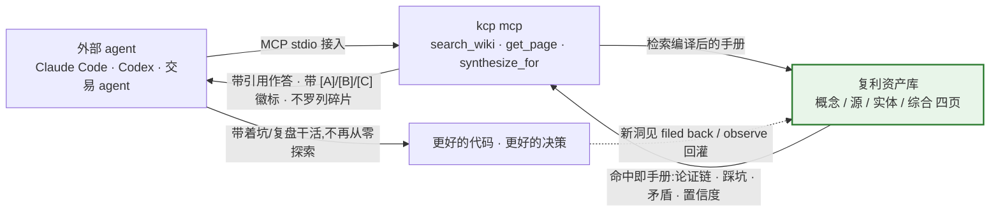
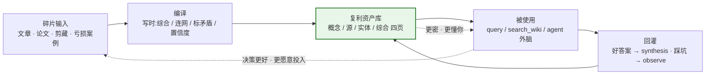

# Knowledge Compounder — 知识编译复利引擎

> **你的 AI 每次都像新员工:不知道你踩过的坑、验证过的策略、定下的约定,所以你只能一遍遍重新交代背景。你的知识呢?躺在收藏夹里吃灰——越收越多,从不回头看。** 这套系统把碎片编译成一份**会复利的私有知识库**:AI 干起活来像老员工,你的研究越查越富。

## 为什么现在需要一个会复利的知识库

**三个问题,一个答案:**

| 你的现状 | 问题 | kcp 的答案 |
|---|---|---|
| 每次对话都要重新交代背景 | **AI 无记忆**:昨天的洞见、踩过的坑,它一概不知道 | 知识库当外脑:踩坑/决策/约定编译进库,`search_wiki` 直接命中 |
| 收藏夹越堆越厚,从不回头看 | **收藏等于吃灰**:云笔记是仓库,知识躺着不动 | 编译连网:不综合进不了库——读过不等于拥有,编译过才连网 |
| 检索返回原文碎片,答案用完即弃 | **检索不增值**:RAG 取原文不沉淀,矛盾现场仲裁 | 写时综合 + 标注矛盾 + 分层置信度,查询读到挤干水分的结论 |

## 有它你能干什么

- **你的 coding agent 带着坑干活**——架构决策、私有约定、踩坑记录进库,`search_wiki` 直接命中「根因 X、修法 Y、别碰 Z」,不用重新探索一遍
- **你的交易 agent 带着复盘干活**——亏损案例、策略取舍、市场观察 observe 回灌,下次决策自带历史教训
- **你自己,研究越查越富**——`kcp query "库里对 X 有什么结论?"` 拼出带引用的综合答案;好答案 filed back 成 synthesis,研究过程本身产出资产

外部 agent 通过 MCP 接上知识库——拿到的不是原文碎片,是带引用的手册:



## 为什么有效:写一次,读一千次

**一篇文章你只会读一次、想一次,但会被你问上一千次。综合、连网、标注矛盾——这些最贵的思考,如果每次查询都让模型现场重做,你就永远在重复付最贵的钱。编译把它提前到写的时候做一次,以后每次读都是免费复用。**

编译和检索的因果差异:

- **写时是全库视野,读时只有片段**——编译时眼前有 5-15 个相关旧页,当场连网、当场发现矛盾;查询时只有命中的几段,没有全局,只能现场拼
- **结构写时埋好,读时只管用**——知识放哪层、置信度几何、矛盾留哪,写时就定;agent 只按相关性排序 + 徽标取用,不在查询时重建结构
- **洞见只在读的那一刻发生**——「这让我想到什么、这在你场景意味着什么」过了就没了;编译把它固定在页面上,变成可复用资产
- **教训只亏一次**——踩坑写进手册,以后 agent 直接带着「别碰 Z」干活,同一个坑不踩第二遍

## 复利长在三个时刻

1. **编译时**——每个新源都连进已有知识网络:知识不是堆积,是连网
2. **查询时**——好答案 filed back 成 synthesis:每次提问都是对库的投资,不是消耗
3. **失败时**——踩坑 observe 回灌:同一个坑只亏一次,教训直接进手册

第一天 agent 拿到的是手册 v1;第一百天拿到的是被你的问题、你的事故、你的复盘喂过的手册 v100。

每一圈使用都让库更密,库更密让每一次使用更有价值——这就是正向飞轮:



**血缘**:方向源自 [Karpathy 的「LLM Wiki / Second Brain」](https://gist.github.com/karpathy/442a6bf555914893e9891c11519de94f)——让 LLM 持续维护一个结构化 Wiki,知识「编译一次、持续维护」,而不是每次查询重新检索。本项目把它工程化:纯 Go 单二进制、任意 LLM 可跑、零第三方依赖,复利闭环做成可验收的 CLI 工作流。

## 为什么不是「又一个 RAG 笔记工具」

> **RAG 解决"怎么取知识"(读侧/外挂,取完不增值);编译复利解决"知识怎么变成资产并复利增值"(写侧/本体,越用越富)。一个是外挂,一个是本体。**

| | RAG 外挂知识库 | 知识编译复利 |
|---|---|---|
| 检索的对象 | 原文碎片(平) | 思考结果:论证链/意外发现/连接+意义/矛盾/置信度 |
| 矛盾处理 | 无,各取一半喂模型 | 写时显式标注,进「张力与缺口」 |
| 置信度 | 无,所有片段同等可信 | 单源=low、多源=high |
| 查询性质 | 消耗,答案用完即弃 | 投资,filed back 让库更密 |
| 随使用变化 | 不变 | 复利增长 |
| 从错误学习 | 不会 | 会(observe 回灌) |

四条本质差别(详见 `docs/与RAG的区别.md`):
1. **知识复利 vs 原地踏步**——RAG 语料是死的,上一轮洞见不沉淀;kcp 每次好查询 filed back,越用越富
2. **跨源综合 vs 原子 chunk**——RAG 给你几块可能矛盾的片段让模型现场仲裁;kcp 写时就完成综合与矛盾标注
3. **写时付费 vs 读时付费**——RAG 索引便宜但每问一次付一次检索+推理钱;kcp 编译贵但查询读到挤干水分的页面
4. **错误模式不同**——RAG 错了是本次错;kcp 编译错误会固化,靠 lint + review_after 兜底

kcp 的检索层**本身是 RAG 的生产基线**(BM25+向量 0.55/0.45 融合),但检索的是编译资产——**增值来自编译,不来自检索**。`kcp eval` 可复现对照实验(实测编译复利 vs 原文 RAG:+1.1 均分,综合/迁移类问题差距最大)。详见 `docs/循环设计.md`。

## 编译产物:四种页面,一份员工手册

核心动作发生在**写的时候**:五篇文档讲同一个东西,先综合成一个概念页;两篇结论冲突,把冲突留下来;以前出过事故,把根因、修法、不能碰的地方沉淀下来。**Agent 真正干活时,拿到的不是五个碎片,而是一份已经整理过的员工手册。**

| 页面 | 装什么 | 怎么产生 |
|---|---|---|
| `sources/` 源页 | 每个 raw 文件的完整论证:结论、论证链(代码/SQL/对比表逐字保留)、意外发现、疑点 | 每编译一个 raw 文件,1:1 生成 |
| `concepts/` 概念页 | **跨源综合**:多篇文档讲同一个东西综合成一页;矛盾显式留在「张力与缺口」;置信度分层(单源=low,多源=high) | 编译时创建/更新,建不建新页由你裁决 |
| `entities/` 实体页 | 人物/工具/项目/组织的关键事实,每条带来源 | 被 2+ 个源提及时才建(单次提及留在源页「术语」节) |
| `synthesis/` 综合页 | 好查询的答案固化成永久分析:问题、证据、张力、结论 | `kcp query` 后 filed back |

检索时不挑类型:**相关性挑页,类型不挑。** 全部页面进同一个混合索引,按相关性排序;每条结果带私有度徽标(`[A]` 公开 / `[B]` 精选综合 / `[C]` 私有踩坑),agent 按徽标判断该多信哪句,再用 `get_page` 深读。

**类型不是给 agent 选的菜单,是编译时埋好的分工**:写的时候决定知识放哪层、什么置信度;读的时候 agent 只管相关性排序 + 徽标——结构红利自动兑现。

## 也在给人用:研究工作台,不是收藏夹

传统云笔记(有道云/印象笔记/Notion)是仓库:收藏、分类、按关键词搜原文,知识躺着不动。kcp 把研究过程本身变成工作台——**存的是原文,长的是你自己的知识网络**:

| | 传统云笔记 | kcp |
|---|---|---|
| 笔记之间的关系 | 无——文件夹是柜子,笔记各自独立 | 交叉引用网络,每页至少 2 个出站链接 |
| AI 的角色 | 一次性摘要,用完即弃 | **编译**:综合、连网、标注矛盾、回灌 |
| 两篇文章冲突 | 并排躺着,你不知道 | 显式写进「张力与缺口」,置信度分层 |
| 收藏的后果 | 越收越多,从不回头看(收藏夹吃灰) | 不综合进不了库——**读过不等于拥有,编译过才连网** |
| 数据 | 锁在他们的云里 | 纯文本 + git,属于你,可导出带走 |

一句话:云笔记让你**存得更整齐**,kcp 让你**想得更深入**——写的时候综合连网,想的时候 `kcp query` 跨页综合出带引用的答案,发现冲突时冲突不消失、进「张力与缺口」。研究恰恰是追踪矛盾的过程。

## 快速上手

> 要求:Go 1.24+。纯 Go、零第三方依赖,`go build` 一个二进制搞定。完整逐步教程与各服务商 BaseURL 清单见 `docs/上手.md`。

```bash
# 1. 克隆 + 编译自研 agent
git clone https://github.com/gcc2ge/knowledge-compounder.git && cd knowledge-compounder
go build -o kcp ./cmd/kcp

# 2. 先验证安装(以下全部零 LLM,不需要任何 API key)
./kcp status                   # 知识库状态 + 未编译 raw
./kcp lint                     # 健康检查(断链/孤儿/格式)
./kcp search "go channel 泄漏" # 混合检索,带 [A]/[B]/[C] 私有度徽标

# 3. 配置任意 LLM → 编译源 → 查询
export KCP_PROVIDER=openai-compatible   # 或 anthropic
export KCP_MODEL=deepseek-chat
export KCP_API_KEY=sk-xxx
export KCP_BASE_URL=https://api.deepseek.com/v1   # ⚠ 必须带 /v1,否则返回 HTML 空转;清单见 docs/上手.md
./kcp compile raw/你的文件.md   # compiler agent 按 SCHEMA 编译(SSE 流式,策展点暂停问人)
./kcp query "知识库里对 X 有什么结论?"

# 4. 喂给其他 agent 当外脑 + 可选对照实验
./kcp mcp                      # wiki → MCP server(支柱 B,纯 Go 零依赖),接入见 context/.mcp.json.example
./kcp eval                     # 对照实验:编译复利 vs RAG 外挂(评估种子见 eval/seeds/)
```

## 自研 agent:全 Go,任意 LLM 可跑

**不再依赖 Claude Code 执行**——整个项目用 Go 实现自己的 agent 运行时(`cmd/kcp` + `internal/`),同一套方法论(SCHEMA)在 OpenAI 兼容(DeepSeek/Ollama/OpenRouter/…)、Anthropic 等任意模型下跑。方法论与执行引擎彻底解耦。

```
cmd/kcp                CLI 入口
internal/provider     M02 Provider 抽象 + 能力位(OpenAI 兼容/Anthropic)
internal/agent        M04 循环:Think-Act-Observe + 停止条件 + 错误自愈
internal/agents       内置角色 system prompt(compiler/query/qa)
internal/tools        M06 工具注册(状态/检索/mentions/反链/读写文件/lint),全 Go 实现
internal/index        内存倒排索引+快照:检索/计数/图查询零全库扫(716 页实测单次检索 307ms→6.6ms)
internal/wiki         知识库操作(扫描/检索/lint),替代原 Python scripts
internal/mcp          支柱 B:MCP stdio server(纯标准库实现协议,零 SDK 依赖)
internal/cli          命令分发
```

工具层纪律:**能确定性解决的绝不交给概率**。「术语被几个源提及」这类建页判据由 `wiki_mentions` 直接计数返回结论(0/1/≥2 三档话术),LLM 不做模糊搜索去数文件;语义判断才留给模型。索引层用标准库实现(倒排 + gob 字典编码快照 + mtime 增量同步),第三方依赖数保持为零;`KCP_INDEX=off` 一键降级回全扫路径。`scripts/` 仅保留 pdf2md.sh(T1/T2 PDF 管道)与 export-public.sh(隐私导出)——Python 工具链已全部移植到 Go。设计见 `docs/harness设计.md`。

## 项目结构

```
knowledge-compounder/
├── SCHEMA.md            ← 编译纪律:页面格式约定(本项目的心智)
├── cmd/kcp + internal/  ← 自研 Go agent:provider/agent/agents/tools/wiki/cli
├── scripts/             ← 保留 shell:pdf2md.sh / export-public.sh(Python 已移植到 Go)
├── templates/           ← source/concept/entity/synthesis 页面模板
├── examples/            ← 合成演示:raw + 编译产物,展示纪律
├── context/             ← 支柱B:kcp mcp 把 wiki 暴露成 MCP server,喂给 coding/trading agents
└── docs/                ← 上手 / 运行原理 / 与RAG的区别 / 场景应用 / 循环设计 / 隐私模型 / harness设计
```

## 两个支柱 + 一条闭环

```
支柱 A: compiler(写)   raw → 编译进 wiki(批量、自主 agent,SCHEMA 驱动)
支柱 B: context(读)    wiki → MCP server → coding/trading/自定义 agents 当外脑
闭环:   observe        踩坑/失败/新模式 → raw/observations → 编译回灌 → wiki 更密
```

## 隐私模型

- 知识库**属于你**:`wiki/` 可导出、可带走(git 天然版本历史)
- 页面级排除(`public: false`)与段落级标记(`<!-- PRIVATE -->`)双机制
- `scripts/export-public.sh` 一键导出公开版,自动替换薪资/股权/本地路径等敏感字段
- **开源的是方法论,不是你的知识**:你的 `wiki/` 与 `raw/` 不进入本项目(见 `.gitignore`)

## 文档导航

- `docs/运行原理.md` — 系统怎么运转(raw → 编译 → 复利闭环 → 喂给 agent)
- `docs/与RAG的区别.md` — 为什么这不是「又一个 RAG 笔记工具」
- `docs/循环设计.md` — 知识复利的运转机制与对照实验
- `docs/场景应用.md` — 编程 / 交易 / 个人学习 / 办公四个场景
- `docs/上手.md` — 逐步入门
- `docs/隐私模型.md` / `docs/harness设计.md` — 隐私与自研 harness 设计

## License

MIT——自由使用、修改、商用,保留版权声明。见 [LICENSE](LICENSE)。

---

*开源方法论,私有 edge 留私库——编译流水线自动化,判断留给人。*
