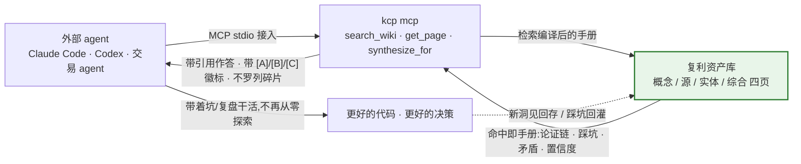
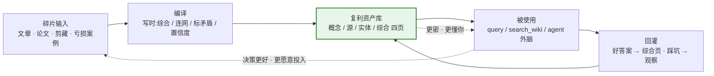
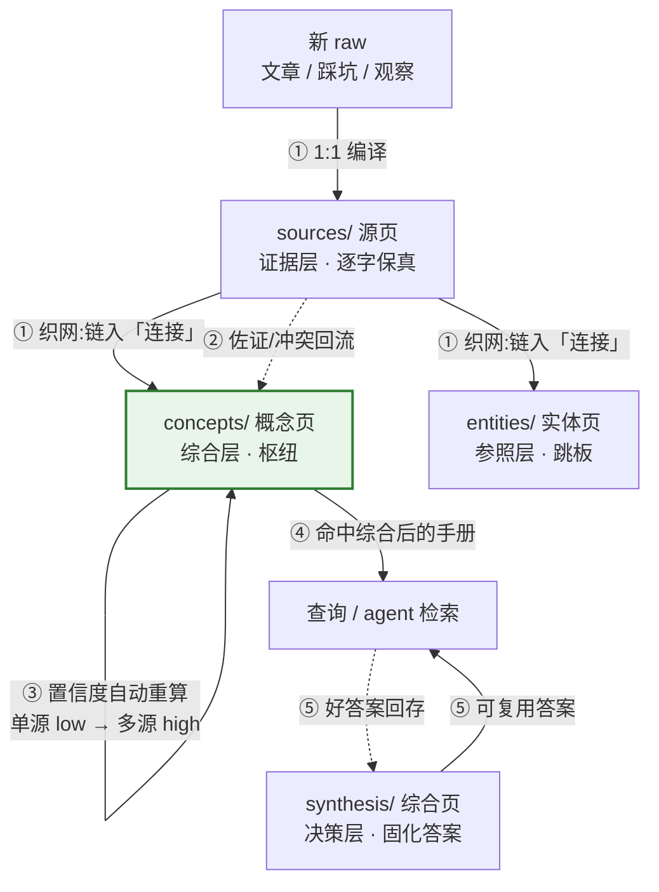

# Knowledge Compounder — 知识编译复利引擎

[](LICENSE)
[](https://go.dev/dl/)
[](https://github.com/gcc2ge/knowledge-compounder)

> **你的 AI 每次都像新员工:不知道你踩过的坑、验证过的策略、定下的约定,所以你只能一遍遍重新交代背景。你的知识呢?躺在收藏夹里吃灰——越收越多,从不回头看。** 这套系统把碎片编译成一份**会复利的私有知识库**:AI 干起活来像老员工,你的研究越查越富。

**一句话心智模型:喂进去的是文章,长出来的是手册。** 别的工具帮你「存」,这套帮你「编」——每次喂入新东西,它当场综合进已有的知识网络,而不是塞进文件夹。

## 为什么现在需要一个会复利的知识库

**三个问题,一个答案:**

| 你的现状 | 问题 | kcp 的答案 |
|---|---|---|
| 每次对话都要重新交代背景 | **AI 无记忆**:昨天的洞见、踩过的坑,它一概不知道 | 知识库当外脑:把坑、决策、约定写进库——你的 AI 一问就带着这些干活 |
| 收藏夹越堆越厚,从不回头看 | **收藏等于吃灰**:云笔记是仓库,知识躺着不动 | 每篇都综合进已有网络——读过不等于拥有,编过才连网 |
| 检索返回原文碎片,答案用完即弃 | **检索不增值**:RAG 只捞原文不沉淀,矛盾现场仲裁 | 写时就综合好、标好矛盾、分好可信度——查询直接读到结论 |

## 有它你能干什么

- **你的 coding agent 带着坑干活**——架构决策、私有约定、踩坑记录写进库,一问就能命中「根因 X、修法 Y、别碰 Z」,不用重新探索一遍
- **你的交易 agent 带着复盘干活**——亏损案例、策略取舍、市场观察回灌进库,下次决策自带历史教训
- **你自己,研究越查越富**——`kcp query "库里对 X 有什么结论?"` 拼出带引用的综合答案;好答案**回存成综合页**,研究过程本身产出资产

外部 agent 通过 MCP 接上知识库——拿到的不是原文碎片,是带引用的手册:



## 为什么需要编译,而不是把原文存下来检索?

「原文存进去,用的时候再检索」是最省事的做法——但那是 RAG:每次查询都现场拼,模型拿到几段可能矛盾的碎片,现场综合、现场仲裁,答案用完即弃,**上一轮的洞见不沉淀**。编译把这条路反着走:

> **最贵的思考,提前到写的时候做一次,摊到未来每次读上。** 一篇文章你只会读一次、想一次,但会被你问上一千次——如果每次查询都让模型现场重做「综合、连网、标注矛盾」,你就永远在重复付最贵的钱。

编译和检索的因果差异:

- **写时是全库视野,读时只有片段**——编译时眼前有 5-15 个相关旧页,当场连网、当场发现矛盾;查询时只有命中的几段,没有全局,只能现场拼
- **结构写时定好,读时拿来就用**——知识放哪层、该信几分、矛盾留哪,写的时候就定好了;读的时候只管按相关性命中,不用现场拼
- **洞见只在读的那一刻发生**——「这让我想到什么、这在你场景意味着什么」过了就没了;编译把它固定在页面上,变成可复用资产
- **教训只亏一次**——踩坑写进手册,以后 agent 直接带着「别碰 Z」干活,同一个坑不踩第二遍

## 为什么不是「又一个 RAG 笔记工具」

> **RAG 解决的是"怎么把原文拿出来",拿完就完;编译复利解决的是"怎么让知识越用越值钱",越用越富。一个是外挂,一个是你的资产。**

| | RAG 外挂知识库 | 知识编译复利 |
|---|---|---|
| 检索的对象 | 原文碎片(平) | 思考结果:论证链/意外发现/连接+意义/矛盾/置信度 |
| 矛盾处理 | 无,各取一半喂模型 | 写时显式标注,进「张力与缺口」 |
| 置信度 | 无,所有片段同等可信 | 单源=low、多源=high |
| 查询性质 | 消耗,答案用完即弃 | 投资,答案回存让库更密 |
| 随使用变化 | 不变 | 复利增长 |
| 从错误学习 | 不会 | 会(踩坑回灌) |

四条本质差别(详见 `docs/03-与RAG的区别.md`):
1. **知识复利 vs 原地踏步**——RAG 语料是死的,上一轮洞见不沉淀;kcp 每次好查询都回存,越用越富
2. **跨源综合 vs 原子 chunk**——RAG 给你几块可能矛盾的片段让模型现场仲裁;kcp 写时就完成综合与矛盾标注
3. **写时付费 vs 读时付费**——RAG 索引便宜但每问一次付一次检索+推理钱;kcp 编译贵但查询读到挤干水分的页面
4. **错误模式不同**——RAG 错了是本次错;kcp 编译错误会固化,靠 lint + review_after 兜底

kcp 的检索层**本身是 RAG 的生产基线**(BM25+向量 0.55/0.45 融合),但检索的是编译资产——**增值来自编译,不来自检索**。`kcp eval` 可复现对照实验(实测编译复利 vs 原文 RAG:+1.1 均分,综合/迁移类问题差距最大)。详见 `docs/03-与RAG的区别.md`。

## 复利长在三个时刻

1. **编译时**——每个新源都连进已有知识网络:知识不是堆积,是连网
2. **查询时**——好答案回存成综合页:每次提问都是对库的投资,不是消耗
3. **失败时**——踩坑回灌:同一个坑只亏一次,教训直接进手册

第一天 agent 拿到的是手册 v1;第一百天拿到的是被你的问题、你的事故、你的复盘喂过的手册 v100。

每一圈使用都让库更密,库更密让每一次使用更有价值——这就是正向飞轮:



**血缘**:方向源自 [Karpathy 的「LLM Wiki / Second Brain」](https://gist.github.com/karpathy/442a6bf555914893e9891c11519de94f)——让 LLM 持续维护一个结构化 Wiki,知识「编译一次、持续维护」,而不是每次查询重新检索。本项目把它工程化:纯 Go 单二进制、任意 LLM 可跑、零第三方依赖,复利闭环做成可验收的 CLI 工作流。

## 编译产物:四种页面,一份员工手册

核心动作发生在**写的时候**:五篇文档讲同一个东西,先综合成一个概念页;两篇结论冲突,把冲突留下来;以前出过事故,把根因、修法、不能碰的地方沉淀下来。**Agent 真正干活时,拿到的不是五个碎片,而是一份已经整理过的员工手册。**

| 页面 | 装什么 | 怎么产生 |
|---|---|---|
| `sources/` 源页 | 每个 raw 文件的完整论证:结论、论证链(代码/SQL/对比表逐字保留)、意外发现、疑点 | 每编译一个 raw 文件,1:1 生成 |
| `concepts/` 概念页 | **跨源综合**:多篇文档讲同一个东西综合成一页;矛盾显式留在「张力与缺口」;置信度分层(单源=low,多源=high) | 编译时创建/更新,建不建新页由你裁决 |
| `entities/` 实体页 | 人物/工具/项目/组织的关键事实,每条带来源 | 被 2+ 个源提及时才建(单次提及留在源页「术语」节) |
| `synthesis/` 综合页 | 好查询的答案固化成永久分析:问题、证据、张力、结论 | `kcp query` 后回存 |

**为什么是这四种?——它们是知识生命周期四层分工,每层喂网络,网络喂复利:**

- **`sources/` 是证据层**——每个原始文件的论证逐字保留。别页引用它时有据可查,网络不会凭空长出结论。
- **`concepts/` 是综合层,复利的主战场**——多篇讲同一个东西,综合成一页;每喂一个新源,系统自动对相关概念页做**佐证/冲突核对**——佐证就加分(置信度上升),冲突就记进「张力与缺口」。概念页越喂越准,不用你手动改。
- **`entities/` 是参照层**——同一个事实被 2+ 篇提过才建页,只留被反复交叉引用的人和事,是 agent 找路的跳板。
- **`synthesis/` 是决策层**——好查询的答案固化成页,每次提问都在给库投资。

**四页怎么织出网络、怎么转出复利——一条递进复利环,五步:**

1. **织网(编译时)**——新文章编译成 `source` 页;扫描相关页,把链接织进「连接」,接上既有概念页 / 实体页
2. **回流(编译时)**——源页对命中的概念页做佐证/冲突核对:佐证 → 置信度上调,冲突 → 写进「张力与缺口」
3. **重算(自动)**——概念页置信度被**自动重算**,单源 low → 多源 high 自动发生;概念页随你喂的次数变密变准
4. **命中(查询时)**——查询 / agent 按相关性命中综合后的概念页,拿到的是手册,不是碎片
5. **固化(查询时)**——好答案**回存**成 `synthesis` 页,下次可复用——每次提问都在给库充值



五步转一圈:概念页更密、综合页更多、agent 的入职培训越来越省——**四页分工喂出网络,网络喂出复利**。

检索时不挑类型:**相关性挑页,类型不挑。** 全部页面进同一个混合索引,按相关性排序;每条结果带私有度徽标(`[A]` 公开 / `[B]` 精选综合 / `[C]` 私有踩坑),agent 按徽标判断该多信哪句,再用 `get_page` 深读。

**类型不是给 agent 选的菜单,是编译时埋好的分工**:写的时候决定知识放哪层、该信几分;读的时候 agent 只管按相关性命中 + 看徽标——写时埋下的分工,读时自动受益。

**一篇真实的编译产物**(来自 `examples/`,格式真实;完整对照:`examples/raw-demo.md` → `examples/compiled/source-demo.md`):

输入 `raw-demo.md` 里的一段 Go:

```go
select {
case ch <- v:
case <-ctx.Done():
    return // 消费者已退出,别阻塞泄漏
}
```

编译成 `source-demo.md` 后,SCHEMA 的纪律各落在哪:

| 编译纪律 | 产物里长什么样 |
|---|---|
| 一句话结论 | 「Go channel 并发有三个铁律——生产者负责关闭、发送时 select 监听取消、错误走同一个 channel——共同解决发送阻塞导致的 goroutine 泄漏」 |
| 论证链逐字保留 | 上面那段 Go 代码**原样**躺在论证链里,不缩写、不转述 |
| 意外发现 | 「泄漏 bug 在测试期几乎测不出来,只在长期压力下浮出——防泄漏必须靠结构纪律而不是测试」 |
| 疑点 | 「错误走同一 channel 在并行多路时会成瓶颈——未验证边界,不影响单对场景正确性」 |

一篇文章编译成一个**自包含的知识单元**:结论、证据、联想、边界全在里面,不看 raw 也能带走全部论证——这才是 agent 下次能直接用的手册。

**那为什么不直接用 raw 原文?** raw 是没消化过的素材:一篇 5000 字的原文,没结论、没连接、没该信哪句的提示——agent 命中它,还得自己重新读一遍、重新提炼。source 页是它的整理版,多出来的是 raw 里没有的:**一句话结论、论证链、意外发现、疑点、连接**。原文保留作证据,页面作手册——一个当出处,一个当干活用的知识。

## 也在给人用:研究工作台,不是收藏夹

这套系统不只喂 agent——**你自己就是第一个用户**。和云笔记(有道云/印象笔记/Notion)的差别一句话:它们**锁数据、存原文**;kcp 数据属于你(纯文本 + git,每页至少 2 个出站链接),而且**不综合进不了库**——读过不等于拥有,编译过才连网。存的是原文,长的是你自己的知识网络。

## 快速上手

> 要求:Go 1.24+。纯 Go、零第三方依赖,`go build` 一个二进制搞定。完整逐步教程与各服务商 BaseURL 清单见 `docs/01-上手.md`。

```bash
# 1. 克隆 + 编译自研 agent
git clone https://github.com/gcc2ge/knowledge-compounder.git && cd knowledge-compounder
go build -o kcp ./cmd/kcp

# 2. 先验证安装(以下全部零 LLM,不需要任何 API key)
./kcp status                   # 知识库状态 + 未编译 raw
./kcp lint                     # 健康检查(断链/孤儿/格式)
./kcp search "go channel 泄漏" # 混合检索,带 [A]/[B]/[C] 私有度徽标

# 3. 配置任意 LLM → 编译源 → 查询
export KCP_PROVIDER=openai-compatible   # 或 anthropic
export KCP_MODEL=deepseek-chat
export KCP_API_KEY=sk-xxx
export KCP_BASE_URL=https://api.deepseek.com/v1   # ⚠ 必须带 /v1,否则返回 HTML 空转;清单见 docs/01-上手.md
./kcp compile raw/你的文件.md   # compiler agent 按 SCHEMA 编译(SSE 流式,策展点暂停问人)
./kcp query "知识库里对 X 有什么结论?"

# 4. 喂给其他 agent 当外脑 + 可选对照实验
./kcp mcp                      # wiki → MCP server(支柱 B,纯 Go 零依赖),接入见 context/.mcp.json.example
./kcp eval                     # 对照实验:编译复利 vs RAG 外挂(评估种子见 eval/seeds/)
```

## 看它跑起来:零 LLM,克隆即玩

构建之后**不用配任何 key**,先跑这两个看真实输出(全新 clone 就是这两个结果):

```bash
$ ./kcp status
---
总页面数 1 | sources 1 / concepts 0 / entities 0 / synthesis 0 / notes 0
未编译 raw: 0
---

$ KCP_RETRIEVE_K=1 ./kcp search "go channel 泄漏"
检索「go channel 泄漏」: 1 条(索引=on(1 页))
- [[go-channel-三铁律]] [C]私有 融合0.72 词法1.00 语义0.37: Go channel 的 goroutine 泄漏源于"发送阻塞而接收方已退出";三铁律——谁创建谁关闭、发送时监听取消、错误与结果同通道——配合 `defer close`,系统性地消除泄漏。
```

一条命中自带**私有度徽标(`[C]`)、混合分数(词法+语义)、一句话结论**——这就是 agent 拿到手的证据格式。完整的 `compile → query` 流需配 key(见 `docs/01-上手.md`);60 秒录屏 GIF 待补:

<!-- 在此插入终端录屏:compile 一篇 raw → query 出带引用答案 → observe 一条踩坑 -->

## 自研 agent:全 Go,任意 LLM 可跑

**不再依赖 Claude Code 执行**——整个项目用 Go 实现自己的 agent 运行时(`cmd/kcp` + `internal/`),同一套方法论(SCHEMA)在 OpenAI 兼容(DeepSeek/Ollama/OpenRouter/…)、Anthropic 等任意模型下跑。方法论与执行引擎彻底解耦。

```
cmd/kcp                CLI 入口
internal/provider     M02 Provider 抽象 + 能力位(OpenAI 兼容/Anthropic)
internal/agent        M04 循环:Think-Act-Observe + 停止条件 + 错误自愈
internal/agents       内置角色 system prompt(compiler/query/qa)
internal/tools        M06 工具注册(状态/检索/mentions/反链/读写文件/lint),全 Go 实现
internal/index        内存倒排索引+快照:检索/计数/图查询零全库扫(716 页实测单次检索 307ms→6.6ms)
internal/wiki         知识库操作(扫描/检索/lint),替代原 Python scripts
internal/mcp          支柱 B:MCP stdio server(纯标准库实现协议,零 SDK 依赖)
internal/cli          命令分发
```

工具层纪律:**能确定性解决的绝不交给概率**。「术语被几个源提及」这类建页判据由 `wiki_mentions` 直接计数返回结论(0/1/≥2 三档话术),LLM 不做模糊搜索去数文件;语义判断才留给模型。索引层用标准库实现(倒排 + gob 字典编码快照 + mtime 增量同步),第三方依赖数保持为零;`KCP_INDEX=off` 一键降级回全扫路径。`scripts/` 仅保留 pdf2md.sh(T1/T2 PDF 管道)与 export-public.sh(隐私导出)——Python 工具链已全部移植到 Go。设计见 `docs/06-harness设计.md`。

## 项目结构

```
knowledge-compounder/
├── SCHEMA.md            ← 编译纪律:页面格式约定(本项目的心智)
├── cmd/kcp + internal/  ← 自研 Go agent:provider/agent/agents/tools/wiki/cli
├── scripts/             ← 保留 shell:pdf2md.sh / export-public.sh(Python 已移植到 Go)
├── templates/           ← source/concept/entity/synthesis 页面模板
├── examples/            ← 合成演示:raw + 编译产物,展示纪律
├── context/             ← 支柱B:kcp mcp 把 wiki 暴露成 MCP server,喂给 coding/trading agents
└── docs/                ← 01-上手 / 02-运行原理 / 03-与RAG的区别 / 04-场景应用 / 05-隐私模型 / 06-harness设计 + README 索引
```

## 两个支柱 + 一条闭环

```
支柱 A: compiler(写)   raw → 编译进 wiki(批量、自主 agent,SCHEMA 驱动)
支柱 B: context(读)    wiki → MCP server → coding/trading/自定义 agents 当外脑
闭环:   observe        踩坑/失败/新模式 → raw/observations → 编译回灌 → wiki 更密
```

## 隐私模型

- 知识库**属于你**:`wiki/` 可导出、可带走(git 天然版本历史)
- 页面级排除(`public: false`)与段落级标记(`<!-- PRIVATE -->`)双机制
- `scripts/export-public.sh` 一键导出公开版,自动替换薪资/股权/本地路径等敏感字段
- **开源的是方法论,不是你的知识**:你的 `wiki/` 与 `raw/` 不进入本项目(见 `.gitignore`)

## 常见疑问

**「会把我的库编译脏吗?」** 编译错误会固化,但有两道兜底:`kcp lint`(断链/孤儿/格式)+ `review_after` 复核;概念页建不建由你裁决;`wiki/` 是纯文本 + git,错了可回滚。

**「费不费钱?」** 写时付费 vs 读时付费:编译那一下贵,但摊到未来每次查询;查询读到挤干水分的页面,读侧便宜。账可以自己算——`kcp eval` 做 RAG-vs-编译复利对照实验,报告落 `eval/reports/`。

**「我已经有 Obsidian/Notion 了,干嘛迁?」** 它们是仓库,你是工作台,不冲突:云笔记负责「存」,kcp 负责「想」。kcp 产物是纯文本 + git,想继续用 Obsidian 双链渲染完全可共存。

## 文档导航

- `docs/README.md` — 阅读索引(从哪读起)
- `docs/01-上手.md` — 逐步入门(含零 LLM 命令清单)
- `docs/02-运行原理.md` — 系统怎么运转(架构 / 编译管线 / 复利三条腿 / 两支柱)
- `docs/03-与RAG的区别.md` — 为什么这不是「又一个 RAG 笔记工具」
- `docs/04-场景应用.md` — 编程 / 交易 / 个人学习 / 办公四个场景
- `docs/05-隐私模型.md` / `docs/06-harness设计.md` — 隐私与自研 harness 设计

## 贡献

觉得有用?点个 ⭐。欢迎 issue / PR——动手前先读 `SCHEMA.md`(编译纪律)与 `docs/06-harness设计.md`(自研 agent 架构)。

## License

MIT——自由使用、修改、商用,保留版权声明。见 [LICENSE](LICENSE)。

---

*开源方法论,私有 edge 留私库——编译流水线自动化,判断留给人。*
